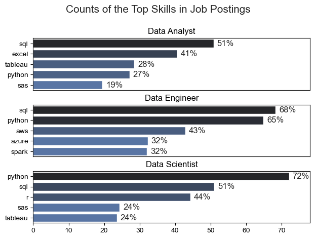
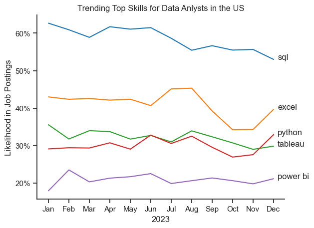
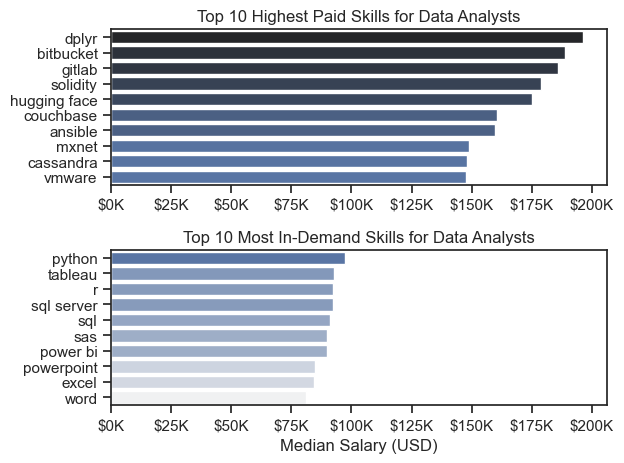
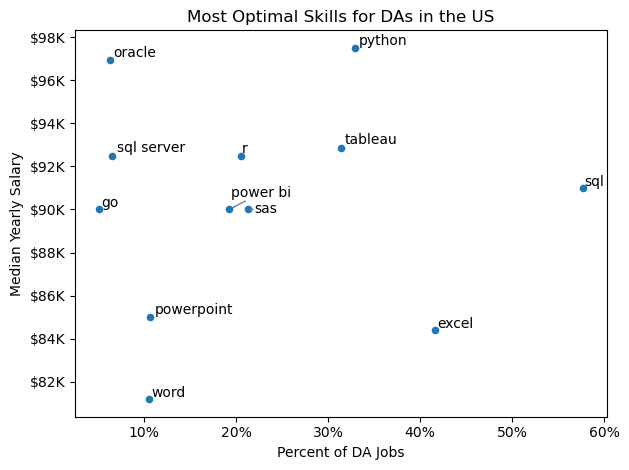
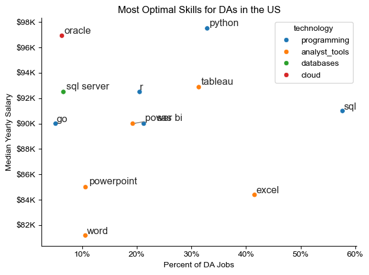

# 1 Intro:

This analysis will be focussed on the Data job market in the US.
It will help get a sense of what technical skills are more in demand and offer higher pay.

The data is sourced from Luke Barousse's Python Course which provides a great amount of information regarding Data Job Postings all around the world. 
It includes the following columns:

```python

print(df.dtypes)

output:
job_title_short                  object
job_title                        object
job_location                     object
job_via                          object
job_schedule_type                object
job_work_from_home                 bool
search_location                  object
job_posted_date          datetime64[ns]
job_no_degree_mention              bool
job_health_insurance               bool
job_country                      object
salary_rate                      object
salary_year_avg                 float64
salary_hour_avg                 float64
company_name                     object
job_skills                       object
job_type_skills                  object
```

We will be exploring some of these columns that are more relevant to our analysis in order to extract some job postings' trends.

Even though we will be looking at the Data Job Market as whole, finding what roles are more in-demand, we will filter down to the Data Analyst job role.


# 2 The Questions

Here is what we want to find out:

1. What are the skills most in demand for the top 3 most popular data roles?
2. How are in-demand skills trending for Data Analysts?
3. How well do jobs and skills pay for Data Analysts?
4. What are the optimal skills for data analysts to learn? (High Demand AND High Paying)

# 3 Tools I Used
- Python: this will be the only language used, mainly from the following libraries:
  - Pandas: data analysis;
  - Matplotlib: data visualization;
  - Seaborn: advanced data visualization.
- Visual Studio Code: for writing and running python scripts.
- Git&GitHub: for version control and project sharing.


# 4 Data preparation and cleanup

## 4.1 Import & Data prep

```python
# Importing Libraries
import ast
import pandas as pd
import seaborn as sns
from datasets import load_dataset
import matplotlib.pyplot as plt  

# Loading Data
dataset = load_dataset('lukebarousse/data_jobs')
#dataset is a DatasetDict that acts like a dictionary
#It has the "train" that all the dataset objects as values. So lets access that and convert to a df:
df = dataset['train'].to_pandas()

# Data Cleanup
df['job_posted_date'] = pd.to_datetime(df['job_posted_date'])
df['job_skills'] = df['job_skills'].apply(lambda x: ast.literal_eval(x) if pd.notna(x) else x)
```

## 4.2 Filter DA Jobs in the US

As previously stated, the analysis, though encompassing various data job roles, will sometimes be narrowed to Data Analysts in the United States.
So when applicable, the following filters will be used:

```python
Data Analysts
df_DA = df[(df["job_title_short"]=="Data Analyst"].copy()

Jobs in the US:
df_US = df[df['job_country'] == 'United States'].copy()

Data Analysts in the US:
df_DA_US=df[(df["job_title_short"]=="Data Analyst")&(df["job_country"]=="United States")].copy()

```

# 5. The Analysis:

## 5.1. What are the most demanded skills for the top 3 most popular data roles?

To get the the most demanded skills for the top 3 most popular data roles we need to filter out those roles (considering the number of job postings) and get the top 5 skills for each of those top 3 roles. 

This query highlights the most popular job titles and their top skills, showing which skills I should pay attention to depending on the role I'm targeting.

View my notebook with detailed steps here: [2_Skill_Demand.ipynb](3_Project/2_Skill_Demand.ipynb)


### Visualize Data

```python

fig,ax = plt.subplots(len(job_titles),1)

for i, job_title in enumerate(job_titles):
    df_plot=df_skills_perc[df_skills_perc["job_title_short"]==job_title].head(5)
    sns.barplot(data=df_plot, x="skill_percent", y="job_skills", ax=ax[i], hue="skill_count", palette="dark:b_r")

plt.show()
```

### Results




### Insights

- Python is highly demanded across all three roles, but especially for Data Scientists (72%) and Data Engineers (65%).
- SQL is the most requested skill for Data Analysts and Data Scientists, demanded in over half the job postings for both roles. 
- Data Engineers require more specialized technical skills (AWS, Azure, Spark) compared to Data Analysts and Data Scientists who are expected to be proficient in more general data management and analysis tools (Excel, Tableau).

## 5.2. How are in-demand skills trending for Data Analysts?

### Visualize Data

```python

from matplotlib.ticker import PercentFormatter

df_plot = df_DA_US_percent.iloc[:, :5]
sns.lineplot(data=df_plot, dashes=False, legend='full', palette='tab10')

plt.gca().yaxis.set_major_formatter(PercentFormatter(decimals=0))

plt.show()

```

### Results


*Bar graph with the trending top skills for data analysts in the US in 2023.*


### Insights

- SQL remains the most consistently demanded skill throughout the year, although it shows a gradual decrease in demand.
- Excel and Python experienced a significant increase in demand starting around October. For the case of Python it even surpassed Tableau by the end of the year.
- Both Python and Tableau show relatively stable demand throughout the year with some fluctuations but remain essential skills for data analysts. Power BI, while less demanded compared to the others, shows a slight upward trend towards the year's end.

## 5.3. How well do jobs and skills pay for Data Analysts?

### Visualize Data

```python
sns.boxplot(data=df_US_top6, x="salary_year_avg", y="job_title_short", order=job_order)

plt.title('Salary Distributions in the United States')
plt.xlabel('Yearly Salary (USD)')
plt.ylabel("")
plt.xlim(0, 600000) 
ticks_x = plt.FuncFormatter(lambda y, pos: f'${int(y/1000)}K')
plt.gca().xaxis.set_major_formatter(ticks_x)
plt.show()
```


### Insights

- There's a significant variation in salary ranges across different job titles. Senior Data Scientist positions tend to have the highest salary potential, with up to $600K, indicating the high value placed on advanced data skills and experience in the industry.

- Senior Data Engineer and Senior Data Scientist roles show a considerable number of outliers on the higher end of the salary spectrum, suggesting that exceptional skills or circumstances can lead to high pay in these roles. In contrast, Data Analyst roles demonstrate more consistency in salary, with fewer outliers.

- The median salaries increase with the seniority and specialization of the roles. 
  
- Senior roles (Senior Data Scientist, Senior Data Engineer) not only have higher median salaries but also larger differences in typical salaries, reflecting greater variance in compensation as responsibilities increase.

### Highest Paid & Most Demanded Skills for Data Analysts

#### Visualize Data

```python
fig, ax = plt.subplots(2, 1)  

sns.set_theme(style="ticks")

# Top 10 Highest Paid Skills for Data Analysts
sns.barplot(data=df_DA_top_pay, x="median", y=df_DA_top_pay.index, ax=ax[0], hue="median", palette="dark:b_r", legend=False)

# Top 10 Most In-Demand Skills for Data Analysts
sns.barplot(data=df_DA_top_skills, x="median", y=df_DA_top_skills.index, ax=ax[1], hue="median", palette="light:b", legend=False)

plt.show()
```


*Two separate bar graphs visualizing the highest paid skills and most in-demand skills for data analysts in the US.*


### Insights
- The top graph shows specialized technical skills like dplyr, Bitbucket, and Gitlab are associated with higher salaries, some reaching up to $200K, suggesting that advanced technical proficiency can increase earning potential.

- The bottom graph highlights that foundational skills like Excel, PowerPoint, and SQL are the most in-demand, even though they may not offer the highest salaries. This demonstrates the importance of these core skills for employability in data analysis roles.

- There's a clear distinction between the skills that are highest paid and those that are most in-demand. Data analysts aiming to maximize their career potential should consider developing a diverse skill set that includes both high-paying specialized skills and widely demanded foundational skills.


## 5.4. What are the most optimal skills to learn for Data Analysts?

To identify the most optimal skills to learn ( the ones that are the highest paid and highest in demand) I calculated the percent of skill demand and the median salary of these skills. To easily identify which are the most optimal skills to learn.

#### Visualize Data:

```python
from adjustText import adjust_text
import matplotlib.pyplot as plt

df_DA_skills_high_demand.plot(kind='scatter', x='skill_percent', y='median_salary')

plt.show()

```


*A scatter plot visualizing the most optimal skills (high paying & high demand) for data analysts in the US.*

### Insights
- The skill Oracle appears to have the highest median salary of nearly $97K, despite being less common in job postings. This suggests a high value placed on specialized database skills within the data analyst profession.

- More commonly required skills like Excel and SQL have a large presence in job listings but lower median salaries compared to specialized skills like Python and Tableau, which not only have higher salaries but are also moderately prevalent in job listings.

- Skills such as Python, Tableau, and SQL Server are towards the higher end of the salary spectrum while also being fairly common in job listings, indicating that proficiency in these tools can lead to good opportunities in data analytics.

### Visualizing Different Technologies


```python
from matplotlib.ticker import PercentFormatter

# Create a scatter plot
sns.scatterplot(
    data=df_plot,
    x="skill_percent",
    y="median_salary",
    hue="technology"
)

texts = []
for _, row in df_plot.iterrows():
  texts.append(
    plt.text(row['skill_percent'], row['median_salary'], row['skills']))

plt.show()

```


*A scatter plot visualizing the most optimal skills (high paying & high demand) for data analysts in the US with color labels for technology.*


### Insights
- The scatter plot shows that most of the programming skills (colored blue) tend to cluster at higher salary levels, indicating that they are considered more valuable within the data analytics field.

- Skills like Oracle and SQL Server offer higher salaries but appear less frequently in DAs job postings, which shows higher valuation but lower demand.

- Analyst tools (colored orange), including Tableau and Power BI, are prevalent in job postings and offer competitive salaries, showing that visualization and data analysis software are crucial for current data roles. 


# 6. What I Learned

Throughout this project, I deepened my understanding of the data analyst job market and enhanced my technical skills in Python, especially in data manipulation and visualization. Here are a few specific things I learned:

- <ins>Advanced Python Usage</ins>: Utilizing libraries such as Pandas for data manipulation, Seaborn and Matplotlib for data visualization, and other libraries helped me perform complex data analysis tasks more efficiently.
- <ins>Data Cleaning Importance</ins>: I learned that thorough data cleaning and preparation are crucial before any analysis can be conducted, ensuring the accuracy of insights derived from the data.
- <ins>Strategic Skill Analysis</ins>: The project emphasized the importance of aligning one's skills with market demand. Understanding the relationship between skill demand, salary, and job availability allows for more strategic career planning in the tech industry.


# 7. Overall Insights

This project provided several general insights into the data job market for analysts:

- <ins>Skill Demand and Salary Correlation</ins>: There is a clear correlation between the demand for specific skills and the salaries these skills command. Advanced and specialized skills like Python and Oracle often lead to higher salaries.
- <ins>Market Trends</ins>: There are changing trends in skill demand, highlighting the dynamic nature of the data job market. Keeping up with these trends is essential for career growth in data analytics.
- <ins>Economic Value of Skills</ins>: Understanding which skills are both in-demand and well-compensated can guide data analysts in prioritizing learning to maximize their economic returns.
  
# 8. Challenges I Faced

This project was not without its challenges, but it provided good learning opportunities:

- <ins>Data Inconsistencies</ins>: Handling missing or inconsistent data entries requires careful consideration and thorough data-cleaning techniques to ensure the integrity of the analysis.
- <ins>Complex Data Visualization</ins>: Designing effective visual representations was challenging but critical for conveying insights clearly.
- <ins>Focussing on and keeping the goal of our analysis</ins>: It is easy to get pulled in while analyzing a dataset and sometimes overanalyze, so you need to keep sight of what you are trying to get from it and work only with what you need - a balance is needed. 

# 9. Conclusion

Critical skills and trends of the data world job market were highlighted in this project. This helps understand what is important in this field, serving as guidance for anyone wanting to pivot or evolve their careers in data analytics. 

The data job market is constantly evolving and so is the skills' demand, so a continued analysis is required, making this project just a stepping stone for future explorations.